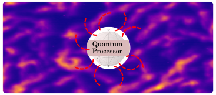

# On the way to create an open source library for noise filtering on a quantum processor

This is the report for the current status of the noise filtering library, a project funded by [unitary.fund](https://unitary.fund/) grant program run by [Will Zeng](http://willzeng.com/).   
In this project, we implement two techniques: **Dynamical Decoupling** (DD), which deals against qubit decoherence, and **Error Mitigation** (EM), which is an extrapolation method to estimate a noise free expected value of some dynamical variable of interest (observable in quantum mechanics jargon).

This report contains the implementation of both techniques in `pyquil`, the software development kit by Rigetti Forest. We analise the results and draw some conclusions. The conclusions are mostly satisfactory, except for the case of combining the both methods (DD and EM) together.

In the second part of the project we will include various noise models to our implementations for current real NISQ (noisy-intermediate-scale-quantum) hardware are open quantum mechanical systems.

(image taken from Quantum Machine Learning edX course by Toronto University)

The unwanted interaction of the quantum computer with the outside world introduces noise into the computations. Different noise models exist to deal with the problem mathematically, each of which constrained to different simplifying assumptions.

We believe that the inclusion of various models will increase the filtering performance of our (soon-to-be-ready) tool, particularly, the combination of DD and EM. We will run our codes on real rigetti's and IBM's hardware (for the latter, we will rewrite the code in `qiskit`).

In the EM_and_DD.ipynb file there are given the theoretical bases of both techniques and presented some illustrations of their performance.

## License

This project is licensed under the MIT License - see the [LICENSE](LICENSE) file for details.
